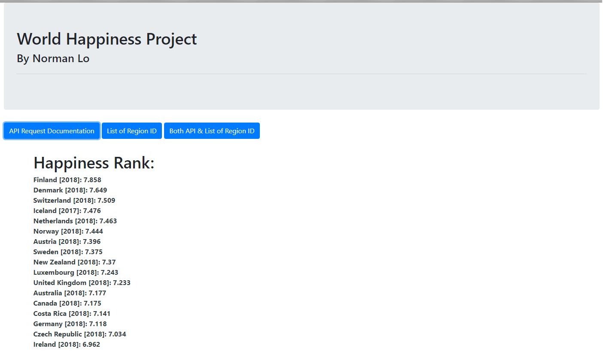

# World Happiness Database API
World Happiness Database API (Backend)
Final Product: https://world-happiness-database.herokuapp.com

## Objective:
This project is designed to create a web API for requesting country level data on several aggregate variables, such as Happiness Scores, Gini Coefficient, GDP, population, GDP per Capita, and geographic location (lat & lon).  

## Data:
The data was collected from different sources and it was cleaned in Python before storing to SQLite database.
- Country Geographic Location: https://developers.google.com/public-data/docs/canonical/countries_csv (Google Web Developer), which contains 246 countries geographic locations.
- Happiness Scores: https://worldhappiness.report/ed/2019/#read (World Happiness Report 2019, which was written by a group of independent experts acting in their personal capacities. Any views expressed in this report do not necessarily reflect the views of any organization, agency or program of the United Nations.), which measures 157 countries happiness from various attributions, such as health, social support, preception of corruption, freedom, etc.
- Gini Coefficient: https://datahub.io/world-bank/si.pov.gini#resource-data (World Bank Data), which records 133 countries in different years.
- GDP, population, region ID: https://datacatalog.worldbank.org/node/140813/api (World Bank Data), which contains 218 countries records.

## Application Setup:
### Stage 1: Data Extraction and Cleaning
Using Python Pandas for data extraction and cleaning process.
### Stage 2: Storing Data into SQLite Database
Using SQLAlchemy creates and stores cleaned data into SQLite database.
### Stage 3: Create Application 
Using Flask creates application connect to the SQLite database and returns to the API request with json format data.
### Stage 4: Create Database Dashboard
Creating a simple home page dashboard for the API request by html and css.
### Stage 5: Deploying the Application
Deploying the web application from Github to Heroku.

## Final Product:
Start Page:

